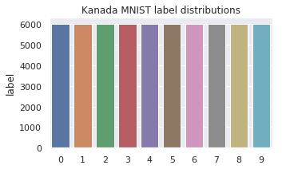
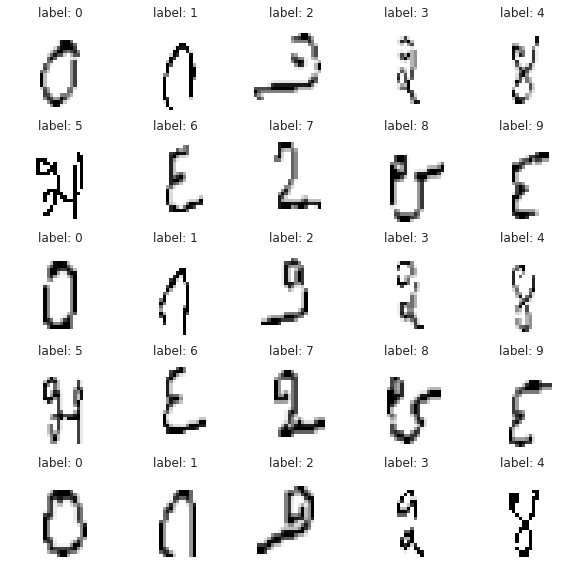
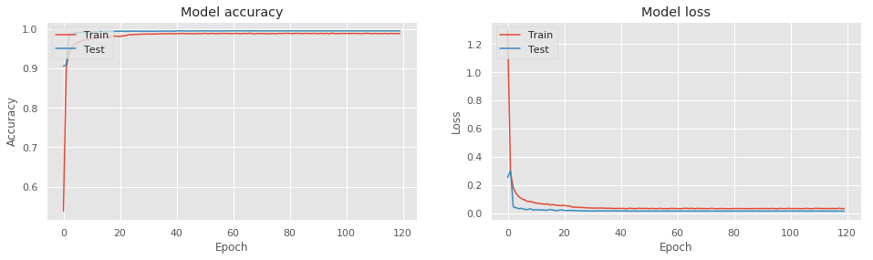

## 0 题目背景

比赛地址：[Kannada MNIST](https://www.kaggle.com/c/Kannada-MNIST/overview)

这是一个MNIST扩展的比赛，识别的不再是阿拉伯数字，而是Kannada数字，分类目标还是0-9，每个分类各有6000的样本，测试样本为5000的随机样本

## 1 数据分析

### 1.1 加载数据

```python
%%time
train_data = pd.read_csv('/kaggle/input/Kannada-MNIST/train.csv')
test_data = pd.read_csv('/kaggle/input/Kannada-MNIST/test.csv')
```

### 1.2 查看label分布情况

```python
label_values = train_data['label'].value_counts().sort_index()
plt.figure(figsize=(5, 3))
plt.title("Kanada MNIST label distributions")
sns.barplot(x=label_values.index, y=label_values)
```


可以看出label分布一致

### 1.3 将csv数据转换成图像

```python
img_train = train_data.drop(["label"], axis=1).values.reshape(-1, 28, 28, 1).astype('float32')
img_label = train_data["label"]
img_test = test_data.drop(["id"], axis=1).values.reshape(-1, 28, 28, 1).astype('float32')
print("img_train.shape = ", img_train.shape)
print("img_label.shape = ", img_label.shape)
print("img_test.shape = ", img_test.shape)
```
训练集包含60000张图片，测试集包含5000张图片

### 1.4 查看一下样本图片及其对应的label

```python
fig = plt.figure(figsize=(10, 10))
show_img = 0
for idx in range(img_train.shape[0]):
    plt.subplot(5, 5, show_img + 1)
    plt.xticks([])
    plt.yticks([])
    plt.grid(False)
    plt.imshow(img_train[idx].reshape(28, 28), cmap=plt.cm.binary)
    plt.title("label: %d" % img_label[idx])
    show_img += 1
    if show_img % 25 == 0:
        break
```



## 2 构建模型

### 2.1 搭建卷积神经网络

由于图片很小，不适合深层的卷积神经网络，所以只需要简单的几层卷积层和池化层就可以了，这里搭建一个6层卷积层，3层池化层，2层全连接层的卷积神经网络

```python
def build_model(input_shape=(28, 28, 1), num_classes = 10):
    input_layer = Input(shape=input_shape)
    # 第一个卷积层，32个卷积核，大小5x5，卷积模式SAME,激活函数prelu
    x = Conv2D(filters=32, kernel_size=(5, 5), padding="same", name="conv1")(input_layer)
    x = PReLU()(x)
    # 第二个卷积层，32个卷积核，大小5x5，卷积模式SAME,激活函数prelu
    x = Conv2D(filters=32, kernel_size=(5, 5), padding="same", name="conv2")(x)
    x = PReLU()(x)
    # 第一层池化层，池化核大小2x2
    x = MaxPooling2D(pool_size=(2, 2))(x)
    # 随机丢弃四分之一的网络连接，防止过拟合
    x = Dropout(0.25)(x)
    # 第三个卷积层，64个卷积核，大小3x3，卷积模式SAME,激活函数prelu
    x = Conv2D(filters=64, kernel_size=(3, 3), padding="same", name="conv3")(x)
    # 第四个卷积层，64个卷积核，大小3x3，卷积模式SAME,激活函数prelu
    x = Conv2D(filters=64, kernel_size=(3, 3), padding="same", name="conv4")(x)
    # 第二层池化层，池化核大小2x2
    x = MaxPooling2D(pool_size=(2, 2))(x)
    # 随机丢弃四分之一的网络连接，防止过拟合
    x = Dropout(0.25)(x)
    # 第五个卷积层，128个卷积核，大小3x3，卷积模式SAME,激活函数prelu
    x = Conv2D(filters=128, kernel_size=(3, 3), padding="same", name="conv5")(x)
    # 第六个卷积层，128个卷积核，大小3x3，卷积模式SAME,激活函数prelu
    x = Conv2D(filters=128, kernel_size=(3, 3), padding="same", name="conv6")(x)
    # 第三层池化层，池化核大小2x2
    x = MaxPooling2D(pool_size=(2, 2))(x)
    # 随机丢弃四分之一的网络连接，防止过拟合
    x = Dropout(0.25)(x)
    # 全连接层,展开操作
    x = Flatten()(x)
    # 添加隐藏层神经元的数量和激活函数
    x = Dense(512, name="full1")(x)
    x = PReLU()(x)
    x = Dense(256, name="full2")(x)
    x = PReLU()(x)
    # 输出层
    x = Dense(num_classes, activation='softmax', name="output")(x)
    model = Model(inputs=input_layer, outputs=x)
    return model
```

### 2.2 查看一下模型结构

Keras支持使用`summary`来查看模型结构

```python
model = build_model()
model.summary()
```

## 3 训练模型

### 3.1 划分训练集和测试集

借助sklearn的`train_test_split`来将数据集划分成训练集和测试集，使用`train_test_split`的好处是它可以按每个label都均匀划分数据集

```python
from sklearn.model_selection import train_test_split
X_data = img_train / 255
Y_data = to_categorical(img_label)
x_train, x_test, y_train, y_test = train_test_split(X_data, Y_data, test_size=0.1)
print("x_train.shape = ", x_train.shape)
print("y_train.shape = ", y_train.shape)
print("x_test.shape = ", x_test.shape)
print("y_test.shape = ", y_test.shape)
```

### 3.2 数据增强

数据增强的作用通常是为了扩充训练数据量提高模型的泛化能力，同时通过增加了噪声数据提升模型的鲁棒性。

```python
train_datagen = ImageDataGenerator(
    rotation_range=9, 
    zoom_range=0.25, 
    width_shift_range=0.25, 
    height_shift_range=0.25
)
train_datagen.fit(x_train)
```

### 3.3 ModelCheckpoint和ReduceLROnPlateau设置

`ModelCheckpoint`可以帮助我们保存在训练过程中模型在测试集上效果最好的模型
`ReduceLROnPlateau`可以根据模型训练情况自动降低学习率

```python
learning_rate_reduction = ReduceLROnPlateau(monitor='val_accuracy', patience=5, verbose=1, factor=0.5, min_lr=0.00001)
checkpoint = ModelCheckpoint("bestmodel.model", monitor='val_accuracy', verbose=1, save_best_only=True)
```

### 3.4 optimizer设置

```python
sgd = SGD(lr=0.1, momentum=0.0, decay=0.0, nesterov=False)
```

### 3.5 编译模型

```python
model.compile(loss='categorical_crossentropy', optimizer=sgd, metrics=['accuracy'])
```

### 3.6 训练模型

```python
epochs = 120
batch_size = 128

history = model.fit_generator(
    train_datagen.flow(x_train, y_train, batch_size=batch_size),
    steps_per_epoch=x_train.shape[0] // batch_size,
    epochs=epochs,
    validation_data=(x_test, y_test),
    callbacks=[checkpoint, learning_rate_reduction])
```

### 3.7 训练结果

绘制loss曲线和accuracy曲线

```python
plt.style.use("ggplot")
plt.figure(figsize=(16, 4))
plt.subplot(1, 2, 1)
plt.plot(history.history['accuracy'])
plt.plot(history.history['val_accuracy'])
plt.title('Model accuracy')
plt.ylabel('Accuracy')
plt.xlabel('Epoch')
plt.legend(['Train', 'Test'], loc='upper left')
plt.subplot(1, 2, 2)
plt.plot(history.history['loss'])
plt.plot(history.history['val_loss'])
plt.title('Model loss')
plt.ylabel('Loss')
plt.xlabel('Epoch')
plt.legend(['Train', 'Test'], loc='upper left')
plt.show()
```

训练曲线如下


## 4 测试集图片

### 4.1 预测测试集

```python
results=model.predict(img_test/255.0)
results=np.argmax(results, axis=1)
```

### 4.2 查看测试结果

```python
fig = plt.figure(figsize=(10, 10))
show_img = 0
for idx in range(img_test.shape[0]):
    plt.subplot(5, 5, show_img + 1)
    plt.xticks([])
    plt.yticks([])
    plt.grid(False)
    plt.imshow(img_test[idx].reshape(28, 28), cmap=plt.cm.binary)
    plt.title("predict: %d" % results[idx])
    show_img += 1
    if show_img % 25 == 0:
        break
```


## 5 提交结果

```python
sub=pd.DataFrame()
sub['id']=list(test_data.values[0:,0])
sub['label']=results
sub.to_csv("submission.csv", index=False)
```

最后结果在0.98920，排名在106/1202

完整代码地址: [Kannada-MNIST](https://github.com/JinbaoSite/Kannada-MNIST)
如果你觉得我写的可以为你带来帮助，请给我一个Star